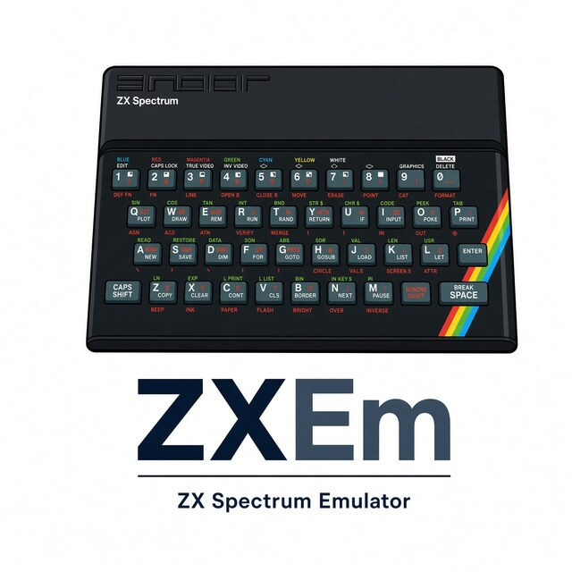
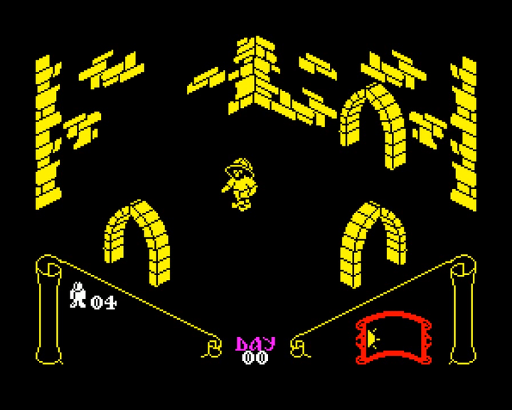

<p align="center">
  
</p>

# ZXEm

ZX Spectrum 48K / 128K / +3 emulator (SDL2).

**ZXEm does not ship Sinclair or Amstrad ROM images, and it does not ship
game files.** You must supply your own copies. That is a legal requirement,
not an optional extra.

[](docs/play-demo.mp4)

## In a hurry (3 steps)

**1.** Build the play binary:

```bash
make release
```

**2.** (Optional) Point ZXEm at Spectrum ROM file(s) you own (`--rom` /
`--rom-dir`), **or skip this** and trust the tiny synthetic ROM ZXEm
generates. Many snapshots run on the synthetic ROM; a real 48K/128K/+3
ROM is better for tape `LOAD` and disk systems.

**3.** Get a game file you own, then run:

```bash
emulator/zxem GAME
```

`GAME` is a snapshot, tape, or disk you already have (`.z80` `.sna` `.tap`
`.tzx` `.trd` `.dsk` …). Zip archives are read in place: `emulator/zxem archive.zip#path/inside.z80`.

Needs SDL2, SDL2_image, libzip, zlib, and a C++23 `g++`. Default `make` is
a sanitizer debug build — use **`make release`** to play.

More flags and controls: [`emulator/README.md`](emulator/README.md).
Leftovers: [`TODO.md`](TODO.md).

## License

[MIT](LICENSE).

**Author:** EdgeOfAssembly  
**Contact:** [haxbox2000@gmail.com](mailto:haxbox2000@gmail.com)
